# CryptoTraits

# Description
`CryptoTraits`is an ImageJ macro that allows to perform a standardised, reproducible, and semi-automated "traditional" morphometric analysis of cryptobenthic fishes from side-view images. It measures 16 morphological traits which are described [here](https://github.com/mattiaghilardi/CryptoTraits/tree/main/Docs/Definitions%20of%20traits%20and%20reference%20lines.pdf). It is written in the ImageJ 1.x macro language, thus can be used in both ImageJ and Fiji. It was first being developed to aid trait measurement for a project on cryptobenthic reef fishes in Palau. The macro is under further development and will be included in a larger toolset for fish morphometric analysis.

# Installation
To install the macro clone or download the entire repository (green button on the project's main page), then copy the `CryptoTraits.ijm` file in the `ImageJ/macros/toolsets/` or `Fiji.app/macros/toolsets/` directory.

Open ImageJ/FIJI, click on the `More tools menu` (`>>`) in the toolbar and select `CryptoTraits`. The macro requires ImageJ 1.53e, thus if you have an older version you must first update it by clicking on **Help -> Update ImageJ...** After the update, restart ImageJ/Fiji and select `CryptoTraits` from the `More tools menu`.

If everything went well, this icon  will appear in the main toolbar.

# How to use it
For anyone minimally familiar with ImageJ the use of this macro will be pretty straightforward. All steps are clearly described through dialog boxes and messages.

## 1. Set up the analysis

 1.1. Create a main directory for the entire analysis, with three subdirectories as follows:

- a directory with the raw images to be analysed (place all images in here);
- a directory where the regions of interest (ROIs) will be saved;
- a directory for the results files (as `.txt`) will be saved.

  See the [Test](https://github.com/mattiaghilardi/CryptoTraits/tree/main/Test) folder for an example. You can also structure it differently, for example having a single output directory for results and ROIs.

 1.2. Start the analysis by clicking on the icon . The first three dialogs will help to set up the analysis:

- A first dialog box will appear (Fig. 1). Here, you must select the input and output directories (i.e. the three directories created in the previous step). You can also write the name with which you want to save the results.

  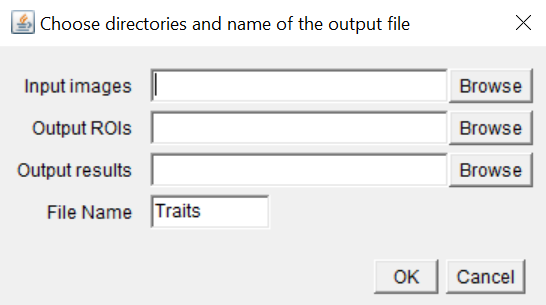 
  <i><b>Fig. 1</b> Initial dialog for the selection of directories.</i>  

- The second dialog (Fig. 2) allows to select the first image to analyse among those present in the input directory. This step helps with analysis across multiple days. In the future version this step and the following will be removed as the program will automatically record the metadata and start from where you left the last time.

  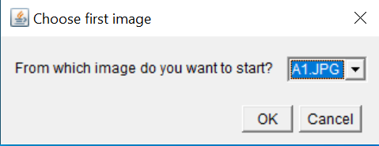 
  <i><b>Fig. 2</b> Select first image to analyse.</i>  

- The third dialog (Fig. 3) allows to select the number of images to be analysed. The maximum number will be the total images in the directory starting from that selected in the previous step. If you have to stop the analysis before completing the number of images selected here is not a problem. Results from all completed images until you stop will be saved.

  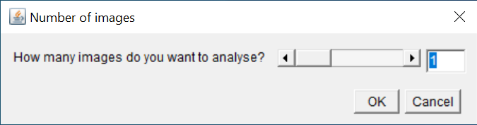 
  <i><b>Fig. 3</b> Select the number of images to analyse.</i>

## 2. Image analysis

 2.1. Once the previous steps are completed, an empty results table with the name you chose in the first dialog is created and a message reminds you to keep this table open, simply minimise it. Close the message and the first image appears, together with the ROI manager and a dialog `Set scale` (Fig. 4).

  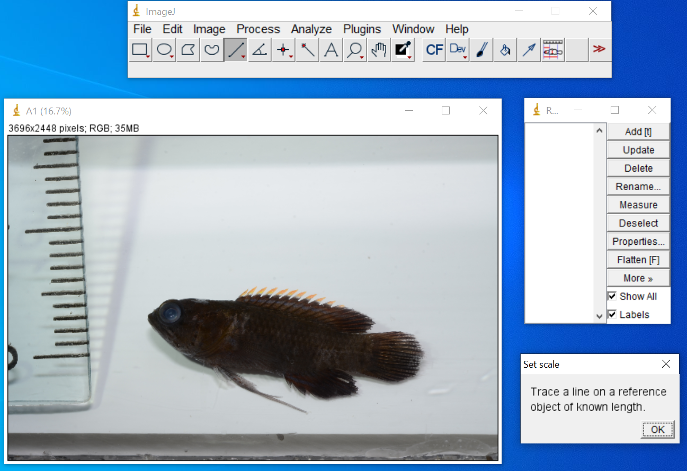 
  <i><b>Fig. 4</b> Desktop appearance at the beginning of the analysis.</i>

 2.2. Set the scale (Fig. 5) by inserting the value and unit in the next dialog. Any unit (mm, cm, inch) will be converted to "*cm*". Therefore, all results will be in centimeters.

  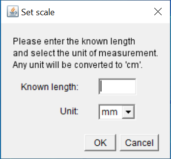 
  <i><b>Fig. 5</b> Set the scale.</i>

 2.3. Once the scale is set, the macro allows to adjust the image if required (Fig. 6). The fish must be straight and horizontal for the analysis. 

  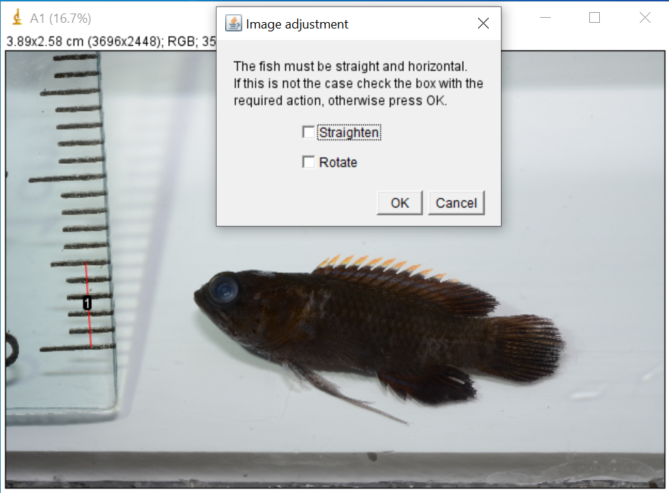 
  <i><b>Fig. 6</b> Adjust the image if required.</i>

 Therefore, if the fish is not straight and horizontal, two options are available:

- `Rotate`: when the fish is straight but not horizontal (Fig. 7)

  <b>Before</b> 
  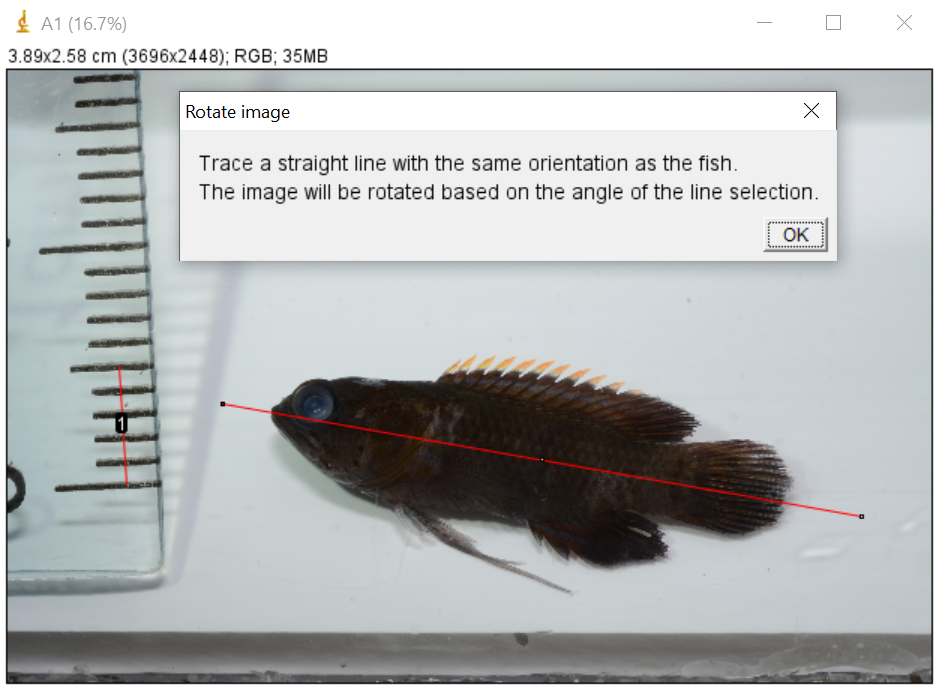 
  <b>After</b> 
  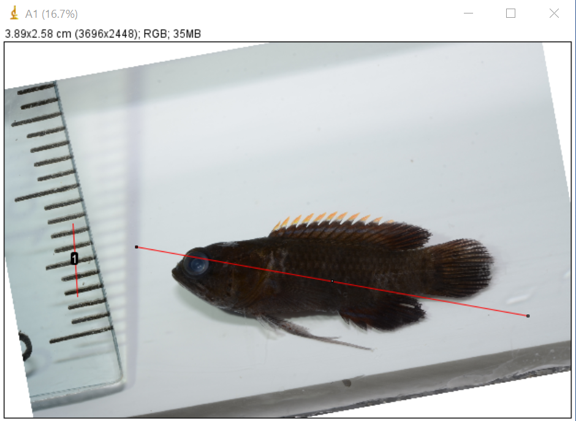 
  <i><b>Fig. 7</b> Rotate the image to set the fish in an horizontal position.</i>  

- `Straighten`: when the fish is bended (Fig. 8)

  <b>Before</b> 
  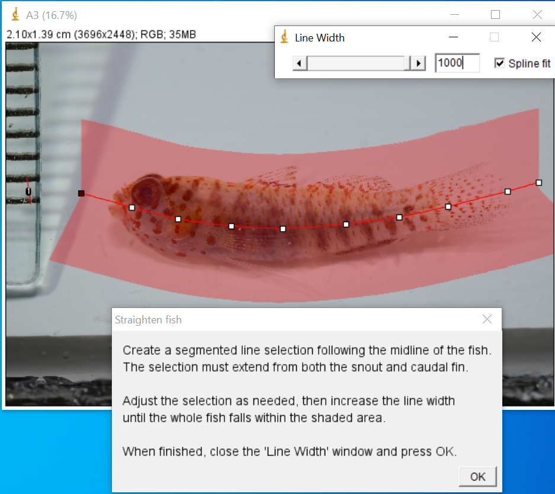 
  <b>After</b> 
  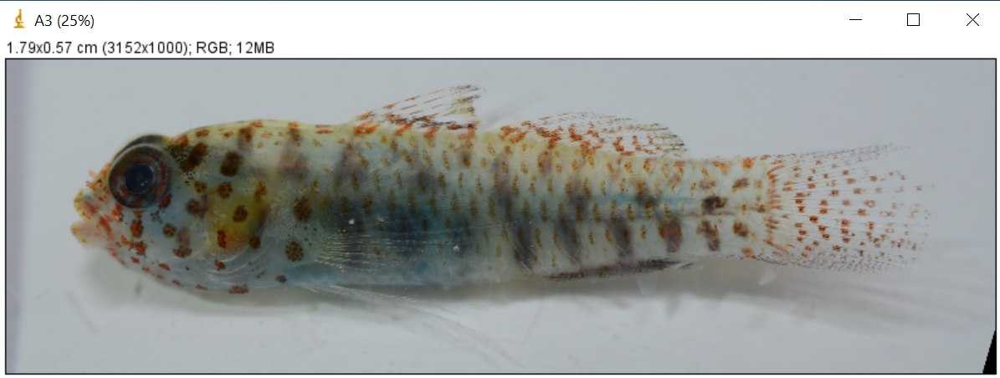 
  <i><b>Fig. 8</b> Straighten the fish if it is in a bended position.</i>

 2.4. `Orientation`: select whether the fish is facing left or right (Fig. 9)

  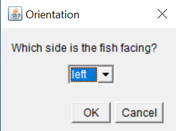 
  <i><b>Fig. 9</b> Select the orientation of the fish.</i>

 2.5. Finished these steps you are ready to draw the reference lines (A-I) (see [this file](https://github.com/mattiaghilardi/CryptoTraits/tree/main/Docs/Definitions%20of%20traits%20and%20reference%20lines.pdf) for a description of the reference lines). The lines are automatically drawn and saved in the ROI manager, you just need to move them in the right position following the instructions in the dialogs. To draw lines H and I you need to draw an ellipse around the eye and they will then appear. Each tool required is automatically selected.

 2.6. Once the reference lines are drawn, you need to select the body area, from the tip of the snout to the narrowest point of the caudal peduncle (line F). To do this, trace a polygon and adjust it as needed. **You MUST cross line F**, the extra area selected will then be automatically cut at line F.

 2.7. You are almost done with the first image. Follow the instructions of the next two steps to add a point at the tip of the upper jaw and another at the corner of the mouth (i.e. the intersection between the maxilla and the mandible). 
After these steps, the analysis of the image is completed and the results file containing values for [16 morphological traits](https://github.com/mattiaghilardi/CryptoTraits/tree/main/Docs/Definitions%20of%20traits%20and%20reference%20lines.pdf) is saved in the chosen directory. The ROIs are saved in their directory, where also the rotated or straightened images are saved as `.jpg` files to allow reproducibility. The image is closed and the next is opened.

 2.8. Repeat steps 2.2. to 2.7. for all the images you decided to analyse. Once finished, a message (Fig. 10) will remind you where the ROIs and results are saved, as well as how many images you analysed. You can check that they are saved properly before closing the results table.

  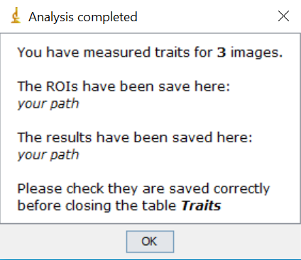 
  <i><b>Fig. 10</b> Final message.</i>

# Bug reporting
Please [report any bug and issue](https://github.com/mattiaghilardi/CryptoTraits/issues)
